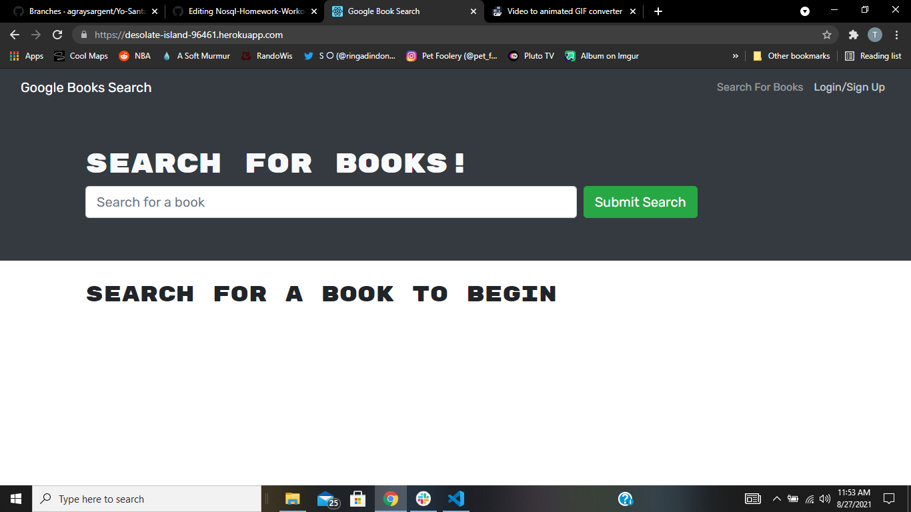
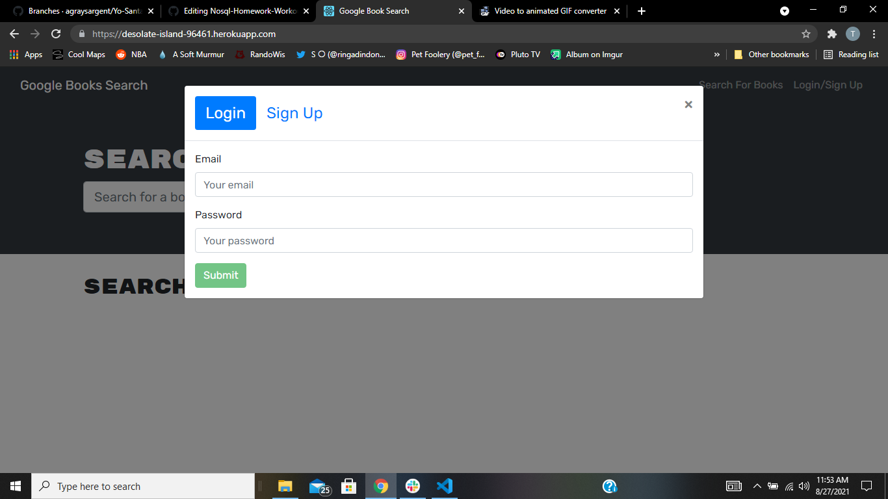
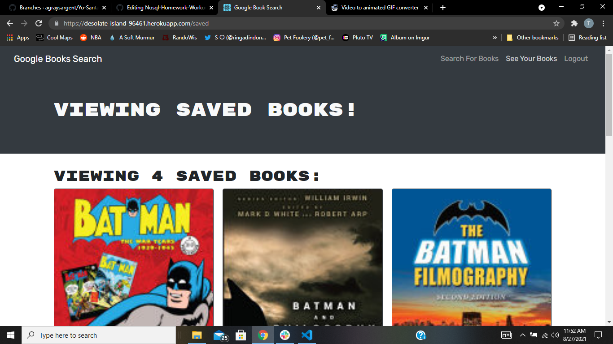

# graphql-book-search-engine

Book search engine that uses graphQL queries and mutations.

👨[Github Profile](https://github.com/PratikPatel-Code/)

🏃[Deployed App](https://desolate-island-96461.herokuapp.com/)

#

## Table of Contents

- [Project Overview](#Overview)

- [Project Goals](#Goals)

- [Running App](#Running)

- [Testing App](#Testing)

- [Contributers](#Contributers)

- [Technologies](#Technologies)

- [Links](#Links)

#

## Overview:

An application that allows user to search and save books using MERN.

#

## Goals:

1. When user enters site, they will have the option to search for books.
2. If the user wants to save a book, they will need to log in or sign up.
3. The user can add books to be saved.
4. The user can go to saved books and see all books that they have saved.
5. The user can also remove books from the saved list.

#

## Running: 🏃

- node.js must be installed
- Download the package.json
- run npm i
- npm start from root

#

## Testing: 🔬

- Testing can be done by running npm run develop

#

## Screenshot/Demo 📸

#

#

#

#

#

#

## Contributers:

👨[Pratik Patel](https://github.com/PratikPatel-Code/)

#

## Technologies: 💻

[Visual Studio](https://visualstudio.microsoft.com/)

[JavaScript](https://www.javascript.com/)

[Mongoose](https://www.npmjs.com/package/mongoose)

[Express](https://www.npmjs.com/package/express)

[React](https://reactjs.org/)

[Node](https://nodejs.org/en/)

[GraphQL](https://graphql.org/)

#

## Links: 🔗

✉️[Email](pratikpatel_85@yahoo.com)

👨[Github Profile](https://github.com/PratikPatel-Code/)

📁[Project Repo](https://github.com/PratikPatel-Code/graphql-book-search-engine)
